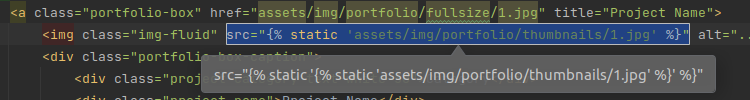

#  1주차 과제

### 실습 과제

주제: **Start Bootstrap 화면 구성하기**

장고 프로젝트를 세팅하고, Start Boostrap 테마를 가져와서 장고 폴더 구조에 맞춰 위치를 시켜주면 된다.

장고에서 화면이 잘 표현되는지를 확인하고 에러가 나는 부분을 함께 작성해서 제출한다.

1. python/pycharm 사용 방법
    - python/pycharm 설치 및 버전 설명 - pycharm 주요 사용 방법
2. 프로젝트 뼈대 만들기 - 가상환경 만들기 및 장고 설치하기
    - `settings.py`  `migrate`, `createsuperuser` - 로켓 그림 보기
3. Start Boostrap 화면 만들기
    - URL, view, templates - 장고에서 Start boostrap 보기
    - src, href 수정하기

작성방법: Pycharm에서 소스 공유 + 에러가 나거나 어려운 부분을 word에 제출

---
### 과제 수행 내용

1. **가상환경 설정**

    <div align="left" style="margin: 30px 0px">
        
    </div>

2. [Creative](https://startbootstrap.com/theme/creative) 테마 다운로드
3. [Blog Post](https://startbootstrap.com/template/blog-post) 템플릿 다운로드
4. 폴더구조

    ```Shell
    CreativeBlogOne
    startbootstrap-blog-post-gh-pages
    startbootstrap-creative-gh-pages
    ```

5. 앞으로 만들 가상환경들을 담을 `venv` 디렉토리를 생성 후 `CreativeBlog` 프로젝트의 가상환경으로 `v310Dj4CreativeBLog`을 생성한다.

    <div style="margin: 30px 0px">
        
    </div>

    <div align="left" style="margin: 30px 0px">
        
    </div>
    

6. `CreativeBlogOne`은 이미 완성된 프로젝트로 `CreativeBLog` 프로젝트를 다음과 같은 구조로 새롭게 만들어서 장고 프로젝트를 진행한다.

    <div align="left" style="margin: 30px 0px">
        
    </div>

7. 결과
    
    - 프로젝트: CreateiveBlogOne
    - 가상환경: v310DjCreativeBlog

    <br>
    <div align="left" style="margin: 30px 0px">
        
    </div>

8. CreativeBlog 프로젝트 admin 생성
    
    <div align="left" style="margin: 30px 0px">
        
    </div>

    ```Shell
    django-admin startproject CreativeBlog
    ```

9. Database 생성

    ```Shell
    python manage.py makemigrations
    
    # db.sqlite3
    python manage.py migrate
    ```

    <div align="left" style="margin: 30px 0px">
        
    </div>
    <div align="left" style="margin: 30px 0px">
        
    </div>

10. 관리자계정생성- `SuperUser`

    ```Shell
    python manage.py createsuperuser
    ```

11. urls.py 설정

    ```python
    # urls.py
    path('', views.HomeView.as_view(), name="home")
    ```
    <div align="left" style="margin: 30px 0px">
        
    </div>

12. views.py 설정

    ```python
    from django.views.generic import TemplateView

    class HomeView(TemplateView):
        template_name = 'home.html'
    ```

13. templates 폴더에 home.html 생성

    <div align="left" style="margin: 30px 0px">
        
    </div>
    
14. 서버 실행

    ```
    python manage.py runserver
    ```
    <div align="left" style="margin: 30px 0px">
        
    </div>

15. templates/home.html에 startboostrap의 index.html을 붙여넣는다.
    > [코드확인](./templates/home.html)

16. static 폴더를 생성 후 그 안에 정적 파일들(js, css, assets)을 저장한다.

    - 서버를 실행하고 페이지를 로딩했을 때 브라우저가 정적 파일을 잘 받아오는지 확인한다.
    
    - 안나올 경우 새로고침해서 `cache`를 삭제해본다.

    <div align="left" style="margin: 30px 0px">
        
    </div>

17. settings.py 설정

    ```python
    TIME_ZONE: ‘Asia/Seoul’
    USE_TZ = False
    
    # ithing
    STATICFILES_DIRS = [BASE_DIR / 'static']

    MEDIA_URL = 'media/'
    MEDIA_ROOT = BASE_DIR / 'media'

    ```

    <div align="left" style="margin: 30px 0px">
        
    </div>


18. 브라우저가 static 폴더의 정적 파일을 받아오지 못하므로 templates/home.html 코드를 수정해야한다.

    
    <div align="left" style="margin: 30px 0px">
        
    </div>
    <div align="left" style="margin: 30px 0px">
        
    </div>
    <div align="left" style="margin: 30px 0px">
        
    </div>    

    - 정규표현식을 사용해 수정하고 싶은 태그의 attributes의 내용을 한번에 수정할 수 있다.

    <br>

    ```Shell
    src="(.*?)"
    src=""

    href="(.*?)"
    href=""

    ``` 


    ```html
    <a class="portfolio-box" href="" title="Project Name">

    ```

19. 다시 브라우저에서 static 폴더의 파일들을 받아오는지 확인한다.

    <div align="left" style="margin: 30px 0px">
        
    </div>   

    <div align="left" style="margin: 30px 0px">
        
    </div>   

---

20. Blog 생성

    ```python
    django-admin startapp blog
    ```
    <div align="left" style="margin: 30px 0px">
        
    </div>   

    <div align="left" style="margin: 30px 0px">
        
    </div>   

    ```
    blog/
    ├── admin.py
    ├── apps.py
    ├── __init__.py
    ├── migrations
    │   └── __init__.py
    ├── models.py
    ├── tests.py
    └── views.py
    ```

21. 생성한 blog app을 settings.py에 등록해준다.

    ```python
    # CreativeBlog/blog/apps.py

    from django.apps import AppConfig

    class BlogConfig(AppConfig):
        default_auto_field = 'django.db.models.BigAutoField'
        name = 'blog'

    ```

22. models.py에 table을 저장한다

    - 생성하려는 모델은 `Post`, `Category`, `Tag`, `Comment` 이다.

    - 모델간의 연관 관계를 어떻게 매핑하는지 확실히 이해해야한다.

    - 장고 ORM이 테이블의 연관 관계를 찾아 자동으로 의존관계를 주입해준다.

    - 하나의 `Category`는 여러개의 `Post`를 가질 수 있지만 그 반대는 아니므로 `1:N`  관계이며 N을 가진 `Post`에 `ForienKey`를 설정한다.

    - 하나의 `Post`는 여러개의 `Comment`를 가질 수 있지만 그 반대는 아니므로 `1:N`  관계이며 N을 가진 `Comment`에 `ForienKey`를 설정한다.


    - 하나의 `Post`는 여러개의 `Tag`를 가질 수 있고 하나의 태그가 여러개의 `Post`를 가질 수 있으므로 `M:N`  관계이다. 이때 하나의 테이블에만 연관관계를 설정해주면된다.

    - `@property` : 메소드이지만 속성처럼 취급해주는 데코레이터

    ```python
    from django.db import models
    from django.urls import reverse


    class Post(models.Model):
        # owner = models.ForeignKey(get_user_model(), on_delete=models.CASCADE, blank=True, null=True)
        category = models.ForeignKey('Category', on_delete=models.SET_NULL, blank=True, null=True)
        tags = models.ManyToManyField('Tag', blank=True)
        title = models.CharField('TITLE', max_length=50)
        description = models.CharField('DESCRIPTION', max_length=100, blank=True, help_text='simple one-line text.')
        image = models.ImageField('IMAGE', upload_to='blog/%Y/%m/', blank=True, null=True)
        content = models.TextField('CONTENT')
        create_dt = models.DateTimeField('CREATE DT', auto_now_add=True)
        update_dt = models.DateTimeField('UPDATE DT', auto_now=True)

        # class Meta:
        #     ordering = ('update_dt',)

        def __str__(self):
            return self.title

        def get_absolute_url(self):
            return reverse('blog:post-detail', args=(self.id,))


    class Category(models.Model):
        name = models.CharField(max_length=50, unique=True)
        description = models.CharField('DESCRIPTION', max_length=100, blank=True, help_text='simple one-line text.')

        def __str__(self):
            return self.name


    class Tag(models.Model):
        name = models.CharField(max_length=50)

        def __str__(self):
            return self.name


    class Comment(models.Model):
        post = models.ForeignKey('Post', on_delete=models.CASCADE, blank=True, null=True)
        content = models.TextField('CONTENT')
        create_dt = models.DateTimeField('CREATE DT', auto_now_add=True)
        update_dt = models.DateTimeField('UPDATE DT', auto_now=True)

        @property
        def short_content(self):
            return self.content[:10]

        def __str__(self):
            return self.short_content
    ```


23. 모델의 변경사항 저장

    ```python
    python manage.py makemigrations
    ```

    <div align="left" style="margin: 30px 0px">
        
    </div>  
    

24. 가상환경에 설치된 패키지 확인

    `File` -> `settings` -> `Project: CreativeBlog` -> `Python Interpreter` 

    <div align="left" style="margin: 30px 0px">
        
    </div>  

25. 이미지 처리를 위해 `pillow` 설치

    <div align="left" style="margin: 30px 0px">
        
    </div>  

26. DB에 migrate

    <div align="left" style="margin: 30px 0px">
        
    </div>  

27. 서버 실행 후 관리자 페이지 접속해보기

    <div align="left" style="margin: 30px 0px">
        
    </div>  

28. 테이블이 표시되지 않으므로 admin.py에 모델을 등록해준다.

    ```python
    from django.contrib import admin

    from blog.models import Post, Category, Tag, Comment


    # Register your models here.
    @admin.register(Post)
    class PostAdmin(admin.ModelAdmin):
        list_display = ('id', 'title', 'update_dt')

        def tag_list(self, obj):
            return ','.join([tag.name for tag in obj.tags.all()])

        def get_queryset(self, request):
            return super().get_queryset(request).prefetch.related('tags')


    @admin.register(Category)
    class CategoryAdmin(admin.ModelAdmin):
        list_display = ('id', 'name', 'description')


    @admin.register(Tag)
    class TagAdmin(admin.ModelAdmin):
        list_display = ('id', 'name')


    @admin.register(Comment)
    class CommentAdmin(admin.ModelAdmin):
        list_display = ('id', 'post', 'short_content', 'create_dt', 'update_dt')
        ```
        <div align="left" style="margin: 30px 0px">
            
        </div>  

29. url 설정
    - 프로젝트 레벨의 url에서 다음처럼 url을 설정하고 하위 프로젝트인 blog 앱의 url과 연결하기 위해 다음과 같이 url.py의 코드를 수정한다.

    <br>

    ```python
    # CreativeBLog/urls
    from django.contrib import admin
    from django.urls import path, include

    from CreativeBlog import views

    urlpatterns = [
        path('admin/', admin.site.urls),
        path('', views.HomeView.as_view(), name='home'),
        path('blog/', include('blog.urls')),
    ]

    ```

    ```python
    # blog/urls

    from django.urls import path

    from blog import views

    urlpatterns = [
        path('post/list/', views.PostListView.as_view(), name='post-list'),
    ]
    ```
30. blog/views에 template을 등록한다.

    ```python
    from django.shortcuts import render

    # Create your views here.
    from django.views.generic import ListView


    class PostListView(ListView):
        template_name = 'blog/post_list.html'

    ```

    <div align="left" style="margin: 30px 0px">
        
    </div>  


31. View 클래스에 대한 이해

    - 로직을 만들 때 어떤 클래스를 상속받아야 하는지 생각해야한다.
    - 그 클래스의 어떤 속성을 overring할 것인지 생각해야한다.
    - template_name: 어떤 template을 보여줄 것인지
    - model: 어떤 모델을 사용할 것인지
    
    <br>

    ```python
    # CreativeBlog/views

    from django.shortcuts import render

    # Create your views here.
    from django.views.generic import ListView

    from blog.models import Post


    class PostListView(ListView):
        template_name = 'blog/post_list.html'
        model = Post
    ```

    <div align="left" style="margin: 30px 0px">
        
    </div>  

    - [blog/post_list.html 코드](./templates/blog/post_list.html)

    <br>

    ```HTML
    # templates/blog/post_list.html

    <!DOCTYPE html>
    <html lang="en">
    <head>
        <meta charset="UTF-8">
        <title>Title</title>
    </head>
    <body>
        <h1>Post List</h1>
        
        <ul>
            <li>{{ post.title }}</li>
        </ul>
        

    </body>
    </html>
    ```

    
    <br>

    |View 클래스 | 기능|
    |:---:|:---:|
    |`TemplateView`| |
    | `RedirectView`| |
    |`ListView`| Table의 모든 레코드를 가져온다|
    |`DetailView`| Table의 특정 레코드 하나만 가져온다. (pk 필요) |
    |`CreateView`| Table에 새로운 레코드를 생성한다.|
    |`UpdateView`| 존재 있는 레코드 중의 하나를 변경 (pk 필요)|
    |`DeleteView`| 존재하는 레코드 중의 하나를 삭제 (pk 필요)|


    <div align="left" style="margin: 30px 0px">
        
    </div>  

    <div align="left" style="margin: 30px 0px">
        
    </div>  
